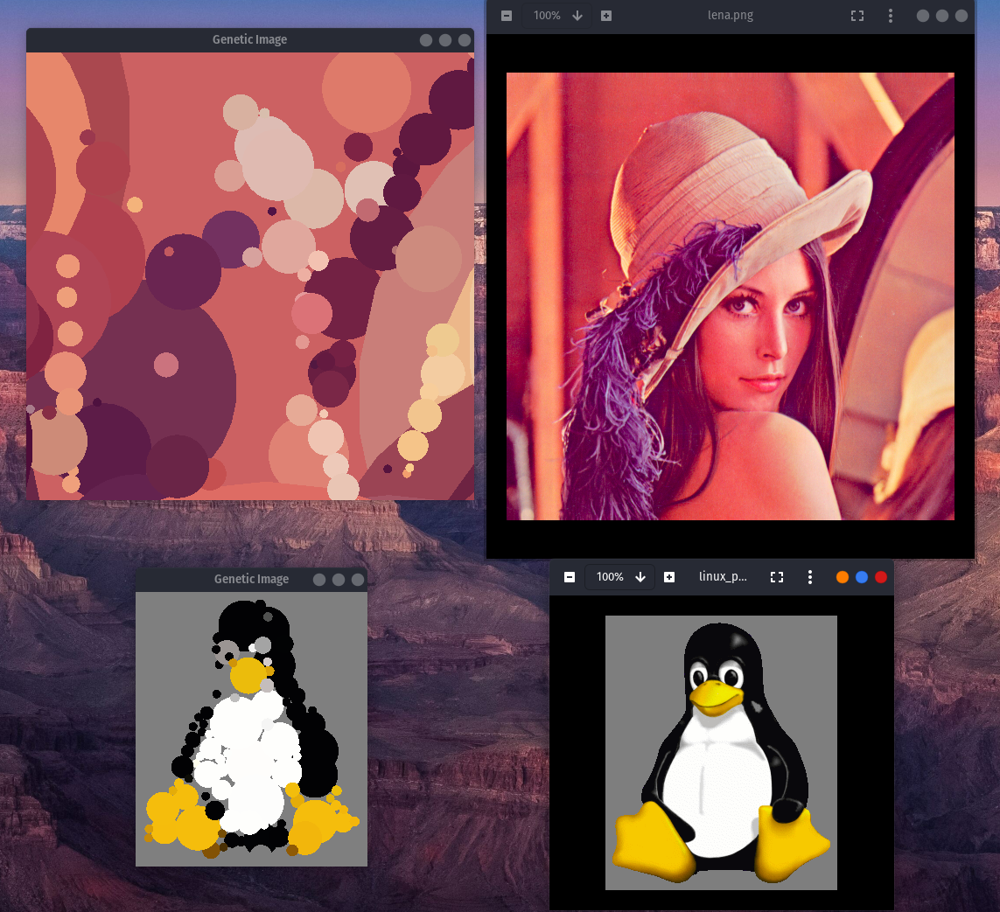

# Image recreation using (1+1) EA
## Installing dependencies
```
sudo apt install libsfml-dev
```
## Fetching git submodules
```
git submodule update --init
```
## Overview
In this project I've tried to implement genetic algorithm which could recreate images using only
circles.
At first, I've tried the classic genetic algorithm, but realised that it is badly suited for this problem.
Mainly because it uses crossover, which is hard to define for images, and has static mutation rate.
I've decided that (1+1) evolution strategy would yield better results.

## Results
### After 30min


## Final thoughts
Generally I'm quite satisfied with the results. Even though, at first I planned to use multithreading
I ultimately didn't do it. I felt that because algorithm only operates on single individual
it would be hard to parallelize (I would have to parallelize image evaluation).
If I were to use multithreading, I would probably move to (mi + lambda) evolution strategy.


